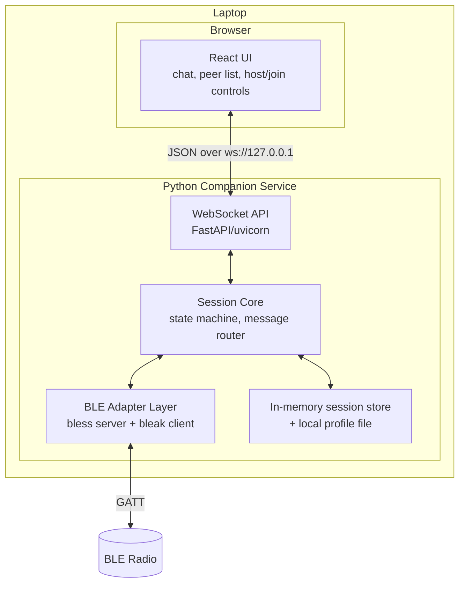
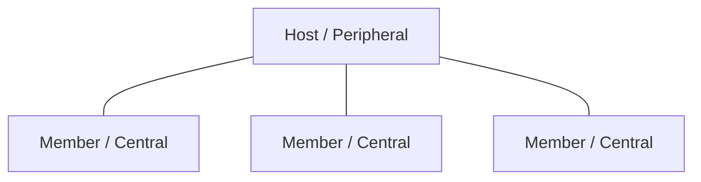
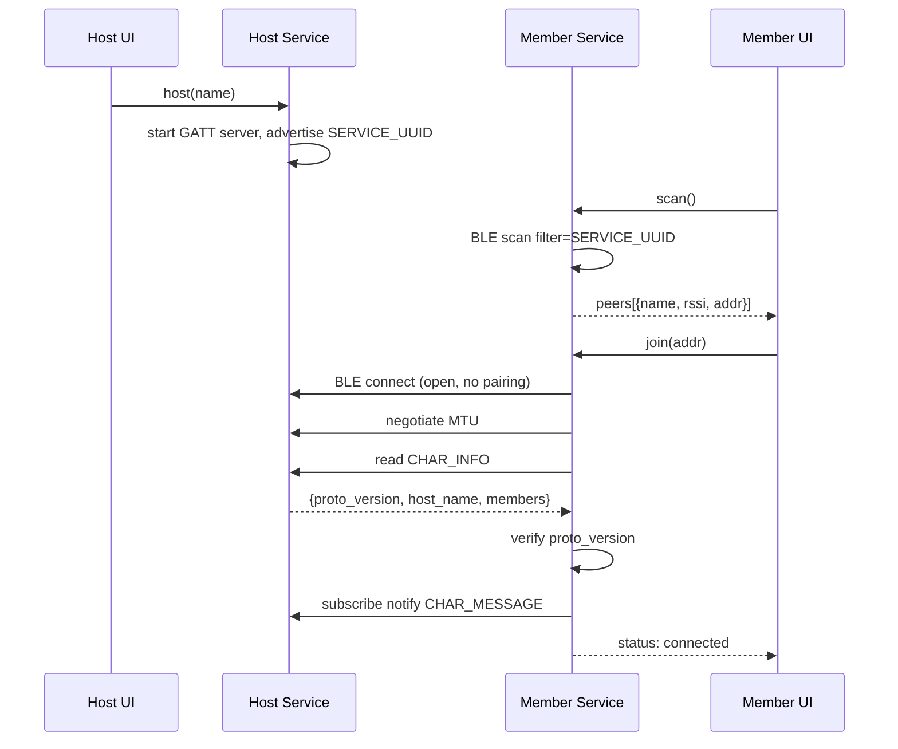
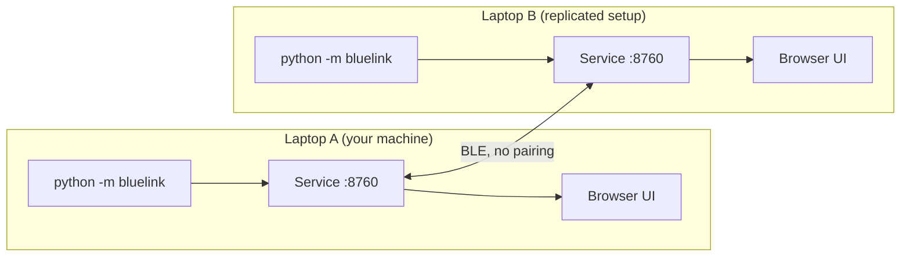

# High-Level Design (HLD) — BlueLink

**Architecture, components, data flow, and deployment for the BLE off-grid chat app.**

| | |
|---|---|
| **Doc status** | Draft v0.1 |
| **Last updated** | 2026-07-11 |
| **Companion docs** | [PRD.md](PRD.md), [TECHNICAL_PRD.md](TECHNICAL_PRD.md), [LLD.md](LLD.md) |

---

## 1. Design goals & driving forces

1. **Off-grid:** no internet/LAN dependency at any layer. Only loopback + BLE.
2. **Zero setup:** no pairing, no OS Bluetooth settings, no accounts.
3. **Replicate-and-run interop:** two machines running the same repo talk with no shared config ([TECHNICAL_PRD §4](TECHNICAL_PRD.md)).
4. **Small, shippable v1:** basic UI, no crypto, single-adapter, foreground use.
5. **Layered for the future:** message framing designed so encryption + access control can be added without a rewrite.

## 2. System context (C4 level 1)


Text fallback:
```
User A → Browser(React) ⇄[localhost WS]⇄ Service A ⇄[BLE GATT, no pairing]⇄ Service B ⇄[localhost WS]⇄ Browser(React) → User B
```

Everything inside one laptop is loopback; the only over-the-air link is Service ⇄ Service over BLE.

## 3. Container view (C4 level 2)



### Containers
- **React UI** — presentation only. Holds no BLE logic; a thin client of the WebSocket API.
- **WebSocket API** — translates UI commands ⇄ core events; serves the built static UI so everything is offline.
- **Session Core** — the brain: role/connection state machine, message router (uplink/downlink/relay), membership, chunking/reassembly orchestration.
- **BLE Adapter Layer** — wraps `bless` (peripheral) and `bleak` (central) behind one internal interface so the core is transport-agnostic.
- **Store** — in-memory session state (messages, members) + a small local profile file (display name). No DB in v1 (stretch: SQLite).

## 4. Roles & topology

A machine is one of two roles per session (v1: not both at once):

- **Host (BLE peripheral):** runs the GATT server, advertises `SERVICE_UUID`, accepts up to 7 centrals, and **relays** messages between members.
- **Member (BLE central):** scans, connects to a host, and exchanges messages only with the host.



Star topology. Members never talk to each other directly; the host is the hub. This keeps 1:1 and group as the *same* code path (1:1 = a group of two).

## 5. Primary data flows

### 5.1 Host starts + member joins (no pairing)


### 5.2 Sending a message (member → host → other members)
```mermaid
sequenceDiagram
  participant MUI as Member A UI
  participant MA as Member A Svc
  participant HS as Host Svc
  participant MB as Member B Svc
  MUI->>MA: send("hi")
  MA->>MA: build envelope, chunk to MTU
  MA->>HS: write chunks -> CHAR_MESSAGE
  HS->>HS: reassemble, deliver to Host UI
  HS->>MB: notify chunks (relay)
  HS->>MA: notify chunks (echo to other members only; A already has it)
  MB->>MB: reassemble
  MB-->>MB: deliver to Member B UI
```

### 5.3 Offline guarantee
No arrow in any flow crosses a non-loopback socket. The BLE link is radio, not IP; the WS link is `127.0.0.1`. Verified by A-4.

## 6. Interoperability strategy (the "replicate to another machine" requirement)

Interop is a **build-time contract**, not runtime setup:

1. **Shared constants in code** — `SERVICE_UUID`, characteristic UUIDs, chunk framing, and `PROTOCOL_VERSION` live in a single module ([LLD §2](LLD.md)) committed to the repo. Cloning the repo = inheriting the contract.
2. **Discovery by service, not address** — members find hosts by scanning for `SERVICE_UUID`; no IPs/MACs are ever configured.
3. **Version handshake** — the Info characteristic carries `PROTOCOL_VERSION`; mismatches fail loud, not silent.
4. **No compatibility-affecting config** — display name and WS port are local conveniences; changing them can't break interop.

Result: *your* laptop and a *freshly set-up* laptop from the same commit communicate with no coordination. Different commits interoperate as long as `PROTOCOL_VERSION` matches; otherwise they refuse cleanly.

## 7. Technology choices & rationale

| Decision | Choice | Why | Alternatives rejected |
|---|---|---|---|
| Transport | BLE (GATT) | Only radio that connects **without pairing** on Windows | Bluetooth Classic (needs bonding); Wi-Fi Direct (heavier, network-ish) |
| Peripheral lib | `bless` | Pure-Python GATT server on WinRT | Native C#/WinRT helper (more moving parts) |
| Central lib | `bleak` | Mature, async, WinRT | pygatt (Linux-centric) |
| Service lang | Python | Fast to build; bleak/bless are Python | Rust/btleplug (no easy peripheral); Node (weaker BLE peripheral story) |
| UI transport | WebSocket | Real-time push both ways over loopback | HTTP polling (laggy); SSE (one-way) |
| UI | React + Vite | Requested; fast dev | — |

## 8. Deployment & setup model

Every participant performs the same one-time setup (see README to be written in M4):

```
1. Install Python 3.10+ and Node 18+
2. git clone <repo>            # same repo == same protocol contract
3. Backend:  pip install -r service/requirements.txt
4. Frontend: cd ui && npm install && npm run build   # emits static assets served by the service
5. Run:      python -m bluelink            # starts service, opens browser to the local UI
```

- The service serves the built UI itself, so a user only launches one process.
- Nothing in setup contacts a network except the one-time `pip`/`npm` install (done while online, before going off-grid).



## 9. Cross-cutting concerns

- **Error handling:** every BLE/WS failure maps to a typed `error` event the UI can render; the service never crashes on a peer disconnect.
- **Logging:** local-only, rotating file logs; no remote reporting (SEC-2). Log level configurable locally.
- **Concurrency:** single `asyncio` loop in the service; BLE callbacks and WS handlers are coroutines on that loop. No shared-state threads.
- **Security posture (v1):** open characteristic — documented as not confidential/not access-controlled. Framing reserves room for a future `enc` envelope and `room` field.
- **Resource use:** idle service is event-driven (no polling loops except BLE scan windows).

## 10. Scalability & limits

- Group size bounded by the adapter's concurrent BLE connection limit (target 7, validated M3).
- Throughput bounded by BLE (~1–20 KB/s) — acceptable for text; a hard cap of 4 KB/message (T-5) bounds chunk counts.
- Single hop only — no relay beyond the host. Range = host's radio range.

## 11. Risks (architectural)

See [PRD.md §15](PRD.md). The architecture-specific one: **`bless` peripheral reliability on Windows** is the load-bearing assumption; M0 exists to validate it, with a native WinRT helper as the fallback that would slot in behind the BLE Adapter Layer without touching the core.

## 12. Future evolution (non-binding)

- **Security layer:** insert a handshake (Noise/libsodium) that wraps the JSON envelope; add a `room` code to the advertisement + Info characteristic for access control.
- **Durable history:** swap in SQLite behind the Store interface.
- **Dual role:** allow a machine to host and join simultaneously (multi-adapter or time-sliced) to approximate a small mesh.
- **Cross-platform:** bleak/bless already support macOS/Linux; enable once Windows is solid.
