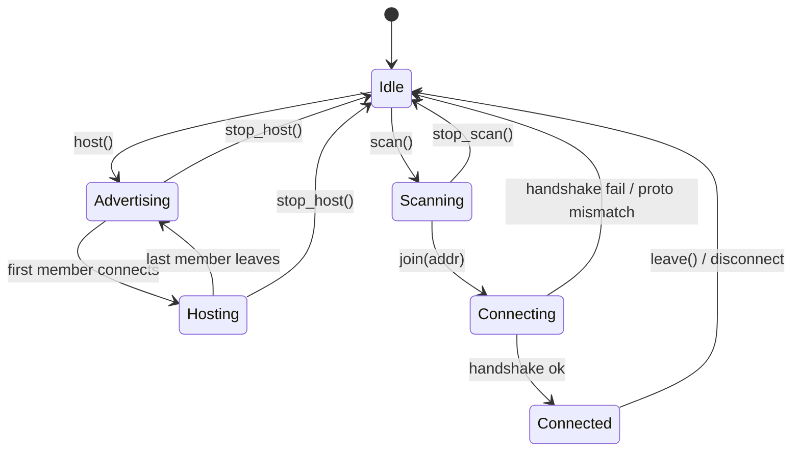

# Low-Level Design (LLD) — BlueLink

**Module specs, BLE GATT profile, wire protocol, WebSocket API, state machines, and error handling.**

| | |
|---|---|
| **Doc status** | Draft v0.1 |
| **Last updated** | 2026-07-11 |
| **Companion docs** | [PRD.md](PRD.md), [TECHNICAL_PRD.md](TECHNICAL_PRD.md), [HLD.md](HLD.md) |
| **Audience** | Implementers |

---

## 1. Project structure

```
bluelink/
├─ service/
│  ├─ bluelink/
│  │  ├─ __main__.py          # entrypoint: start service, open browser
│  │  ├─ constants.py         # ★ INTEROP CONTRACT — UUIDs, PROTOCOL_VERSION, framing sizes
│  │  ├─ config.py            # local-only settings (ws port, log level, profile path)
│  │  ├─ profile.py           # load/save display name (local file)
│  │  ├─ core/
│  │  │  ├─ session.py        # SessionManager: role state machine, membership
│  │  │  ├─ router.py         # MessageRouter: uplink/downlink/relay logic
│  │  │  ├─ framing.py        # chunk() / Reassembler — wire framing
│  │  │  └─ envelope.py       # build/parse JSON message envelopes
│  │  ├─ ble/
│  │  │  ├─ interface.py      # BleTransport ABC (core depends on this, not on bleak/bless)
│  │  │  ├─ peripheral.py     # HostTransport  (bless GATT server)
│  │  │  └─ central.py        # MemberTransport (bleak GATT client)
│  │  ├─ web/
│  │  │  ├─ server.py         # FastAPI app, static UI mount, /ws endpoint
│  │  │  └─ protocol.py       # WS command/event (de)serialization
│  │  └─ logging_setup.py
│  └─ requirements.txt
└─ ui/                        # React (JSX, no TypeScript) + Vite; builds to static assets served by the service
   ├─ src/
   │  ├─ api/ws.js            # WebSocket client, command/event helpers
   │  ├─ state/store.js       # UI state (peers, messages, connection status)
   │  └─ components/          # ChatWindow.jsx, PeerList.jsx, Composer.jsx, StatusBar.jsx
   ├─ jsconfig.json           # editor IntelliSense for plain JS (no tsconfig)
   └─ index.html
```

## 2. Shared constants (`constants.py`) — the interop contract

```python
# constants.py  — NEVER read these from config/env/network. Changing any is a breaking change.
PROTOCOL_VERSION   = 1

SERVICE_UUID       = "6b1d0000-8f3a-4b2c-9c4e-1a2b3c4d5e6f"
CHAR_MESSAGE_UUID  = "6b1d0001-8f3a-4b2c-9c4e-1a2b3c4d5e6f"   # write (uplink) + notify (downlink)
CHAR_INFO_UUID     = "6b1d0002-8f3a-4b2c-9c4e-1a2b3c4d5e6f"   # read

ADV_NAME_PREFIX    = "BLK1-"     # advertised local name = prefix + short display name
MAX_MEMBERS        = 7
MAX_BODY_BYTES     = 4096        # per logical message

# Framing (see §4). Chunk header is fixed 7 bytes.
CHUNK_HEADER_FMT   = ">BHHH"     # ver(1) msg_id(2) seq(2) count(2)  -> 7 bytes
CHUNK_HEADER_LEN   = 7
FRAME_VERSION      = 1           # framing format version (independent of PROTOCOL_VERSION)
DEFAULT_MTU        = 23          # ATT default; real value set by negotiation
```

> `config.py` holds only local-only values (WS port default `8760`, log level, profile file path). These do **not** cross the wire and cannot break interop.

## 3. BLE GATT profile

### 3.1 Service
- Primary service, UUID = `SERVICE_UUID`.
- Advertised by the host with the local name `ADV_NAME_PREFIX + <display name truncated to fit ~26-byte adv budget>`.
- If the display name doesn't fit the advertisement, the full name is read from the Info characteristic after connect (Open Question §12.4 → resolved: name always also in Info char).

### 3.2 Characteristics
| Characteristic | UUID | Properties | Permissions | Payload |
|---|---|---|---|---|
| **Message** | `CHAR_MESSAGE_UUID` | Write (no rsp) + Write + Notify | Open (no encryption/auth) | One **chunk** (§4) |
| **Info** | `CHAR_INFO_UUID` | Read | Open | JSON: host metadata (§3.3) |

- **Uplink (member → host):** member issues GATT **Write** of each chunk to the Message characteristic.
- **Downlink (host → member):** host sends **Notify** on the Message characteristic (one chunk per notification).
- Notifications and writes are both capped at `MTU - 3` bytes (ATT overhead).

### 3.3 Info characteristic payload
```json
{ "proto": 1, "host": "Priya", "members": 3, "max_members": 7 }
```
Read by the member immediately after connecting; `proto` is checked against `PROTOCOL_VERSION` (fail closed on mismatch).

## 4. Wire framing (chunking & reassembly) — `framing.py`

BLE payloads are tiny, so every logical JSON message is split into ordered chunks.

### 4.1 Chunk layout (on the Message characteristic)
```
byte 0        : frame_version (uint8)   = FRAME_VERSION
bytes 1-2     : msg_id       (uint16, big-endian)  per-sender rolling id
bytes 3-4     : seq          (uint16)   0-based chunk index
bytes 5-6     : count        (uint16)   total chunks for this msg_id
bytes 7..N    : payload      (raw UTF-8 JSON slice), len <= (MTU-3) - 7
```

### 4.2 Sender algorithm
```python
def chunk(payload: bytes, msg_id: int, mtu: int) -> list[bytes]:
    body = mtu - 3 - CHUNK_HEADER_LEN          # usable bytes per chunk
    parts = [payload[i:i+body] for i in range(0, len(payload), body)] or [b""]
    count = len(parts)
    return [struct.pack(CHUNK_HEADER_FMT, FRAME_VERSION, msg_id, seq, count) + p
            for seq, p in enumerate(parts)]
```

### 4.3 Receiver algorithm (`Reassembler`)
- Keyed by `(sender_conn, msg_id)`.
- Buffers chunk payloads by `seq`; when all `count` chunks are present, concatenate in `seq` order → UTF-8 → JSON → hand to router.
- **Guards:** reject if `frame_version != FRAME_VERSION`; drop and log if a buffer exceeds `MAX_BODY_BYTES + overhead`; evict incomplete buffers after a timeout (e.g. 10 s) to bound memory.
- `msg_id` rolls `0..65535`; collisions are avoided by the reassembly timeout being far shorter than the wrap time at BLE speeds.

## 5. WebSocket API (UI ↔ service) — `web/protocol.py`

All frames are JSON objects with a `t` (type) field. Endpoint `ws://127.0.0.1:<port>/ws`.

### 5.1 Commands (UI → service)
| `t` | Fields | Effect |
|---|---|---|
| `set_name` | `name` | Persist display name locally |
| `host` | — | Enter Host role: start GATT server + advertise |
| `stop_host` | — | Stop advertising, disconnect members, → Idle |
| `scan` | — | Start scanning for `SERVICE_UUID` |
| `stop_scan` | — | Stop scan |
| `join` | `addr` | Connect to host at BLE `addr`, handshake, subscribe |
| `leave` | — | Disconnect from host, → Idle |
| `send` | `body` | Send a chat message (≤ `MAX_BODY_BYTES`) |
| `get_status` | — | Request a `status` event |

### 5.2 Events (service → UI)
| `t` | Fields | Meaning |
|---|---|---|
| `status` | `role, state, host_name?` | Role/state changed (see §7) |
| `peers` | `[{addr, name, rssi}]` | Current scan results (de-duplicated, RSSI-sorted) |
| `member_list` | `[{name}]`, `count` | Current group membership |
| `message` | `id, sender, ts, body, mine` | A chat message to display |
| `sent` | `id` | Local message written to the link |
| `error` | `code, detail` | Typed error (see §8) |

### 5.3 Example exchange
```
UI  → {"t":"host"}
SVC → {"t":"status","role":"host","state":"advertising","host_name":"Priya"}
UI  → {"t":"send","body":"hello"}
SVC → {"t":"sent","id":"a1b2..."}
SVC → {"t":"message","id":"c3d4...","sender":"Arun","ts":"2026-07-11T09:00:00Z","body":"hi","mine":false}
```

## 6. Message envelopes (`envelope.py`)

Carried inside the reassembled JSON (the `body` payload of chunks). `type` distinguishes chat vs. control.

| `type` | Direction | Fields | Purpose |
|---|---|---|---|
| `hello` | member → host | `name`, `proto` | Announce self on connect (redundant with Info read; confirms member name to host) |
| `msg` | any | `id, sender, ts, body` | Chat message |
| `member_list` | host → members | `members: [name]` | Broadcast on join/leave |
| `system` | host → members | `text` | e.g. "Arun joined" |

- Envelope schema is reserved for growth: future `enc` (encryption metadata) and `room` (access code) fields can be added without changing the framing.

## 7. State machines

### 7.1 Service role/connection state


### 7.2 Member join handshake (detail)
```
connect(addr) [no pairing]
  → negotiate MTU
  → read CHAR_INFO
  → if info.proto != PROTOCOL_VERSION: emit error(incompatible_protocol); disconnect
  → subscribe notify CHAR_MESSAGE
  → write hello{name, proto}
  → state = Connected; emit status(connected, host_name)
```

## 8. Error handling & typed errors

The service never crashes on peer/adapter faults. Every failure becomes an `error` event:

| `code` | Trigger | UI treatment |
|---|---|---|
| `adapter_unavailable` | No BLE adapter / adapter off | Banner: "Turn on Bluetooth" |
| `peripheral_unsupported` | `bless` can't start GATT server | Blocking notice; hosting disabled |
| `incompatible_protocol` | Info `proto` ≠ local | "Peer is a different version" |
| `connect_failed` | `bleak` connect/timeouts | Toast; peer stays in list to retry |
| `peer_disconnected` | Link dropped | Mark disconnected; allow rejoin |
| `message_too_large` | body > `MAX_BODY_BYTES` | Reject at composer |
| `reassembly_timeout` | Incomplete chunk set | Drop silently; log |
| `internal` | Unexpected | Generic toast; details in local log |

Reconnection: on `peer_disconnected` a member may re-issue `join(addr)`; a host keeps advertising and accepts re-connections automatically.

## 9. BLE adapter layer interface (`ble/interface.py`)

Core depends only on this ABC, so `bless`/`bleak` (or a future native helper) are swappable:

```python
class BleTransport(ABC):
    async def start_host(self, adv_name: str, on_write, on_member_change): ...
    async def stop_host(self): ...
    async def scan(self, on_result) -> None: ...      # emits {addr,name,rssi}
    async def stop_scan(self): ...
    async def join(self, addr: str) -> HostInfo: ...  # connect+MTU+read info; raises on mismatch
    async def subscribe(self, on_notify): ...
    async def send_uplink(self, chunk: bytes): ...     # member → host (write)
    async def notify_all(self, chunk: bytes, exclude=None): ...  # host → members (relay)
    async def leave(self): ...
```

- `HostTransport` (bless) implements host + notify_all; `MemberTransport` (bleak) implements scan/join/subscribe/send_uplink.
- The router calls `notify_all(..., exclude=origin_conn)` to relay without echoing back to the sender.

## 10. Message router (`core/router.py`) — relay logic

```
on inbound chunk (host side, from member M):
   reassemble → envelope
   if type == msg:
       deliver to local UI (message event, mine=false)
       notify_all(chunks, exclude=M)          # fan out to other members
   if type == hello:
       register M.name; broadcast member_list + system("M joined")

on local send (host):
   build msg envelope; deliver to own UI (mine=true, echo)
   notify_all(chunks, exclude=None)

on inbound notify (member side):
   reassemble → envelope → deliver to UI
```

1:1 is the `MAX_MEMBERS = 1..1` case of the same code.

## 11. Configuration (`config.py`) — local only

| Key | Default | Notes |
|---|---|---|
| `ws_host` | `127.0.0.1` | MUST stay loopback (SEC-3) |
| `ws_port` | `8760` | Local; if busy, try next free and report to launcher |
| `profile_path` | `%APPDATA%/BlueLink/profile.json` | Stores display name |
| `log_level` | `INFO` | Local rotating file only |

None of these affect interop.

## 12. Testing hooks

- **`framing.py`**: property test — `reassemble(chunk(x, id, mtu)) == x` for random `x` up to `MAX_BODY_BYTES` and MTUs from 23 upward.
- **Router**: unit test relay fan-out with a fake `BleTransport` (no radio) — assert exclude-origin and member_list broadcasts.
- **WS protocol**: round-trip (de)serialization of every command/event.
- **Interop (manual, per release)**: two-laptop fresh-clone test per [TECHNICAL_PRD §4.5](TECHNICAL_PRD.md).
- **Offline audit**: run under Wireshark with Wi-Fi off; assert no non-loopback packets.

## 13. Implementation order (maps to milestones)

1. `constants.py`, `framing.py` (+ tests) — the contract and the trickiest logic first.
2. `ble/interface.py` + a **fake transport** → build/test core without hardware.
3. M0 spike: `peripheral.py` + `central.py` raw string exchange (no pairing) on two laptops.
4. `core/session.py`, `router.py`, `web/server.py` → wire the full 1:1 path (M1).
5. React UI against the WS API (M1).
6. Group relay + membership (M3), robustness (M2), packaging (M4).
